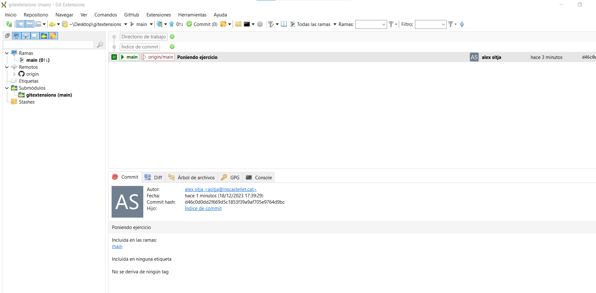

## Exercise 2: Collaborative Repository Work

In this exercise, the focus is on continuing the work from Exercise 1, emphasizing collaboration.

### Instructions:

1. **GitHub Configuration:**
   - Configure the repository on GitHub to allow a classmate to clone it and push changes.

2. **Local Repository Setup:**
   - Clone the repository locally using Git Extensions.

3. **Adding Contribution Documentation:**
   - Create an `E2Contributing.md` file.
   - Document the process of making the repository shareable.
   - Explain how it's cloned using Git Extensions.
   - Include screenshots illustrating the steps.

4. **Collaborative Work:**
   - Create a folder named `A2` + your teammate's name (e.g., `A2ernestbofill`).
   - Inside it, add an `index.html` file with `<h1>Add your code here</h1>` content.
   - Commit and push these changes to the repository.

   [Imagen](Images/trabajo%20compi.png)

5. **Working in Pairs:**
   - Clone your partner's repository using Git Extensions.
   - Locate a folder with your name inside.
   - Modify the `index.html` to create a beginner's guide to Git.
   - Add links to Git resources and explain the content of each link.
   - Commit and push your changes to your partner's repository on GitHub.

   [Imagen](Images/2.png)

6. **Final Steps:**
   - Once your partner finishes their work, pull the latest changes.
   - Capture a screenshot of the work history in Git Extensions.
   - Add this screenshot to the `E2Contributing.md` file.

### Submission:
Provide the GitHub repository link with the latest changes for the teacher's review.